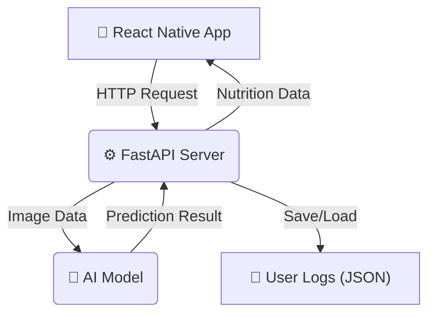

# 헬짱 (HELLZZANG)
AI 기반 무료 칼로리 추적 및 식단 관리 애플리케이션

---

## 🎯 프로젝트 목표 및 배경

최근 건강 관리에 대한 관심이 높아지면서 AI를 활용한 칼로리 추적 앱의 수요가 증가하고 있습니다. 하지만 'CalAI'와 같은 기존 서비스들은 대부분 유료 구독 모델로 운영되어, 가벼운 마음으로 시작하려는 학생이나 일반 사용자에게는 진입 장벽이 존재합니다.

본 프로젝트는 누구나 부담 없이 접근할 수 있는 **무료 AI 칼로리 추적 앱**을 개발하는 것을 목표로 합니다. 사용자가 음식 사진을 찍는 것만으로 식단을 손쉽게 기록하고, AI 분석을 통해 섭취 영양 성분을 자동으로 계산하여 건강한 식습관 형성을 돕고자 합니다.

## 👥 대상 사용자

이런 분들께 '헬짱'을 추천합니다.

- **운동 매니아**: 근육량 증가, 체지방 감소 등 명확한 목표를 가지고 식단을 관리하는 분
- **다이어터**: 일일 섭취 칼로리를 계산하며 즐겁게 식단을 조절하고 싶은 분
- **건강 관리 입문자**: 비용 부담 없이 AI 식단 관리 서비스를 처음 경험해보고 싶은 학생 및 사회초년생

## ✨ 주요 기능

- **AI 음식 인식**: 카메라로 음식 사진을 촬영하여 간편하게 식단을 기록합니다.
- **영양 정보 분석**: 칼로리, 탄수화물, 단백질, 지방 섭취량을 자동으로 계산하고 추적합니다.
- **일일 통계**: 목표치 대비 현재 섭취량을 시각적인 그래프로 확인합니다.
- **식단 로그 관리**: 사용자별, 날짜별로 식사 기록을 저장하고 조회할 수 있습니다.

## ⚙️ 아키텍처 및 기술 스택

### 시스템 아키텍처



### 기술 스택

| 구분 | 기술 | 내용 |
| --- | --- | --- |
| 📱 **Frontend** | `React Native (Expo)`, `TypeScript` | 웹과 모바일 환경에서 모두 사용 가능한 크로스플랫폼 앱 개발 | 
| ⚙️ **Backend** | `FastAPI`, `Python` | AI 모델 서빙 및 데이터 처리를 위한 API 서버 구축 | 
| 🤖 **AI/ML** | `TensorFlow`, `Keras`, `MobileNetV2` | 사전 학습된 MobileNetV2 모델을 기반으로 전이 학습 및 미세 조정 | 
| 📦 **Data** | `Pandas`, `NumPy` | 음식 영양 정보 및 학습 데이터 처리 | 

## 📊 주요 결과 및 평가

사용자 테스트를 통해 다음과 같은 주요 결과와 피드백을 얻었습니다.

- **AI 모델 정확도**: 자체 구축한 데이터셋으로 학습한 모델의 인식 정확도는 **71%** 수준입니다.
- **사용성**: 사용자들은 '사진만 찍으면 칼로리가 기록되는' 핵심 기능에 높은 만족도를 보였으며, 수동 입력 방식에 비해 시간과 노력이 크게 절감된다는 점을 긍정적으로 평가했습니다.
- **개선 필요성**: 다만, 실제 사용 환경에서는 조명이나 각도에 따라 인식률이 달라지는 등 정확도 개선이 필요하다는 피드백이 있었습니다.

## 🚀 향후 개선 계획

- **AI 모델 고도화**: 사용자로부터 수집된 이미지 데이터를 재학습하여 인식 정확도를 지속적으로 향상시킬 예정입니다.
- **DB 확장**: 외식 메뉴, 간편식 등 더 다양한 음식을 인식할 수 있도록 데이터베이스를 확장합니다.
- **개인화 기능 추가**: 사용자가 직접 탄수화물, 단백질, 지방 비율을 설정하는 등 개인별 목표에 맞춘 영양 관리 기능을 추가할 계획입니다.

## 👨‍💻 팀원 및 역할

| 이름 | 역할 | 담당 업무 |
| --- | --- | --- |
| **안결** | 팀장, 백엔드/프론트엔드 | 프로젝트 총괄 및 전반적인 개발 |
| **최성규** | AI 모델러 | 인공지능 모델 학습 및 모듈 개발, 서버 관리 |
| **박경민** | 백엔드 | 백엔드 API 개발 및 데이터베이스 관리 |

## 📂 디렉토리 구조

```
HELL_ZZANG/
├── frontend/         # React Native 프론트엔드 코드
├── backend/          # FastAPI 백엔드 코드
│   ├── main_test.py  # API 서버 메인 파일
│   ├── food_df.csv   # 음식별 영양 정보 데이터
│   └── *.h5          # 학습된 모델 가중치
├── ai_test_choi/     # AI 모델 학습 및 테스트용 Jupyter 노트북
└── images/           # 모델 학습에 사용된 음식 이미지
```

## 🚀 시작하기

### 사전 준비

- [Node.js](https://nodejs.org/)
- [Python](https://www.python.org/)
- `pip` (Python 패키지 관리자)

### Frontend

1.  `frontend` 디렉토리로 이동합니다.
    ```bash
    cd frontend
    ```
2.  필요한 패키지를 설치합니다.
    ```bash
    npm install
    ```
3.  Expo 개발 서버를 시작합니다.
    ```bash
    npx expo start
    ```

### Backend

1.  `backend` 디렉토리로 이동합니다.
    ```bash
    cd backend
    ```
2.  가상 환경을 생성하고 활성화합니다.
    ```bash
    python -m venv venv
    source venv/Scripts/activate
    ```
3.  필요한 패키지를 설치합니다.
    ```bash
    pip install -r requirements.txt
    ```
4.  FastAPI 개발 서버를 실행합니다.
    ```bash
    uvicorn main_test:app --reload --host 0.0.0.0 --port 8000
    ```

---

Branch 로 특정 기능 추가할때마다 버젼을 나눠주세요

2025/03/28/최성규 합류

testing

asdfgh

현재 프론트엔드는 변경 완료되었고 
문제는 음식이름이랑 index랑 예측이 안맞음 index로는 올바르게 예측하는데 이름을 이상하게 불러옴
node.js 깔고 install sweetalarm2 를 깔아줘야함

images 폴더에 Multigrain rice 폴더 이름을 multigrain rice 로 앞 글자를 소문자로 변경하면 해결됩니다.
폴더 이름 변경했는데 브랜치에 포함이 안됐습니다 방법 찾아보겠습니다.